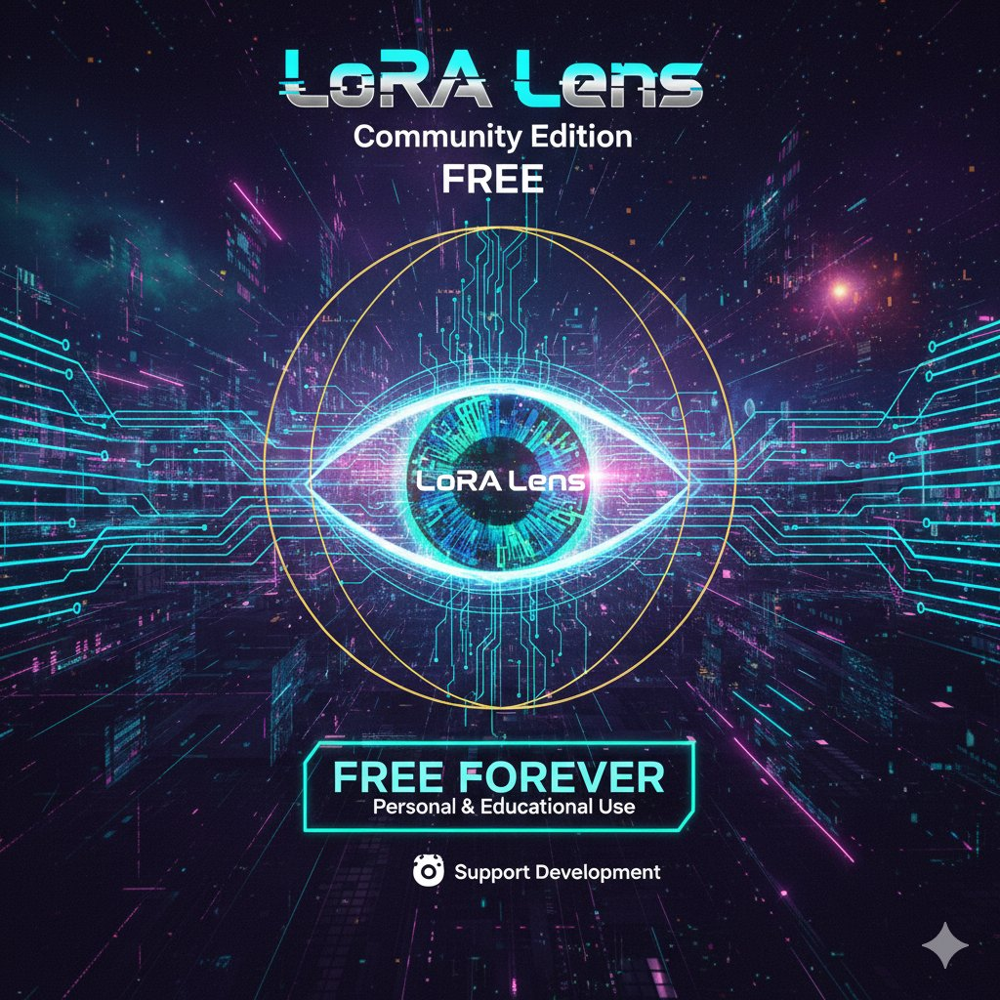

<p align="center">
  
</p>

<h1 align="center">🧠 LoRA Lens</h1>
<h3 align="center">The Intelligence Multiplier</h3>

<p align="center">
  <strong>Compress LoRAs by 65‑94%. Load 10‑20× more. Unlock exponential knowledge combinations.</strong>
</p>

<p align="center">
  <a href="https://opensource.org/licenses/MIT"></a>
  <a href="https://www.python.org/downloads/"></a>
  <a href="https://github.com/intuitivation/LoRA-Lens/releases"></a>
  <a href="https://github.com/intuitivation/LoRA-Lens/stargazers"></a>
</p>

<p align="center">
  <a href="#-quick-start">🚀 Quick Start</a> •
  <a href="https://intuitivation.gumroad.com/l/LoRALens-Pro">💼 Pro $49</a> •
  <a href="https://intuitivation.gumroad.com/l/LoRALens-Studio">🏢 Studio $149</a> •
  <a href="QUICKSTART.md">📖 Full Docs</a>
</p>

---

## The Problem

LoRA files are **144–487 MB each**. You can load maybe 2–3 at a time before your VRAM is gone. That means your model is only accessing a fraction of the specialized knowledge available to it.

**LoRA Lens fixes this.** Compress your LoRAs by 65–94%, load 10–20 simultaneously on the same hardware, and unlock exponentially more knowledge combinations:

```
 3 LoRAs loaded  →       7 combinations
10 LoRAs loaded  →   1,023 combinations
15 LoRAs loaded  →  32,767 combinations
```

Same GPU. Same model. Thousands of times more capability.

---

## Benchmarks

Tested on real, publicly available LoRAs. Verify these yourself — download links below.

### Compression by Format

| Format | Original | After Rank Opt | After Quantization | Total Reduction |
|--------|----------|----------------|-------------------|-----------------|
| **SD 1.5** | 144 MB | 18 MB | 9 MB | **93.8%** |
| **SDXL** | 144 MB | 16 MB | 8 MB | **94.4%** |
| **FLUX** | 487 MB | 175 MB | 87 MB | **82.1%** |

### Quality Retention

| Metric | SD 1.5 | SDXL | FLUX |
|--------|--------|------|------|
| Variance Retained | 99.2% | 99.4% | 99.1% |
| SNR | 48.2 dB | 51.7 dB | 46.8 dB |
| MSE | 0.0012 | 0.0008 | 0.0015 |

### 10-LoRA Verification Test

| LoRA | Original | Compressed | Reduction |
|------|----------|------------|-----------|
| flux_koda_style | 342.0 MB | 1.4 MB | **99.6%** |
| flux_anime_style | 42.8 MB | 1.9 MB | **95.6%** |
| dmd2_sdxl_4step | 750.9 MB | 154.3 MB | **79.4%** |
| hypersd_sdxl_2step | 750.9 MB | 186.0 MB | **75.2%** |
| hypersd_sdxl_1step | 750.9 MB | 193.9 MB | **74.2%** |
| hypersd_sdxl_8step | 750.9 MB | 239.6 MB | **68.1%** |
| hypersd_sdxl_4step | 750.9 MB | 245.4 MB | **67.3%** |
| lcm_lora_sd15 | 128.4 MB | 71.0 MB | **44.7%** |
| hypersd_sd15_4step | 256.7 MB | 142.8 MB | **44.4%** |
| hypersd_sd15_8step | 256.7 MB | 143.1 MB | **44.3%** |
| **TOTAL** | **4,780.9 MB** | **1,379.3 MB** | **71.2%** |

All 10 extract with max weight difference < 0.001. Full database as `.loradb`: **727.9 MB** (47% additional reduction).

<details>
<summary><strong>🔗 Download source LoRAs to verify</strong></summary>

- **Hyper-SD** (ByteDance): https://huggingface.co/ByteDance/Hyper-SD
- **DMD2** (tianweiy): https://huggingface.co/tianweiy/DMD2
- **LCM-LoRA SD1.5**: https://huggingface.co/latent-consistency/lcm-lora-sdv1-5
- **FLUX Style LoRAs**: Available on CivitAI

</details>

---

## How It Works

### Stage 1 — SVD Rank Optimization

Singular Value Decomposition identifies and removes unused dimensions in each layer's weight matrices. Most LoRAs are trained at higher ranks than they need — LoRA Lens finds the optimal rank automatically.

→ **30–90% reduction** depending on format. Quality retention: 99%+.

### Stage 2 — 8-Bit Quantization *(Pro/Studio)*

Converts BFloat16/Float16 weights to Int8 with per-tensor symmetric scale factors. Designed specifically for visual model LoRAs, not adapted from LLM quantization.

→ **Additional 50% reduction** on top of Stage 1.

### Stage 3 — .loradb Collections

A new single-file format that stores collections of LoRAs using **differential compression** — only the weight deltas between LoRAs are stored. Related LoRAs (character variants, style series) compress dramatically:

```
Traditional:                          .loradb:
├─ character_1.safetensors  144 MB    ├─ Base (compressed)     20 MB
├─ character_2.safetensors  144 MB    ├─ Diff 1 (delta only)    2 MB
├─ character_3.safetensors  144 MB    ├─ Diff 2 (delta only)    3 MB
└─ Total: 432 MB                      └─ Total: 25 MB  (94% smaller)
```

| Collection | Individual | As .loradb | Reduction |
|------------|-----------|------------|-----------|
| 50 character LoRAs | 7.2 GB | 380 MB | **94.7%** |
| 100 style LoRAs | 14.4 GB | 890 MB | **93.8%** |
| 20 lighting LoRAs | 2.88 GB | 145 MB | **95.0%** |

Reconstruct any individual LoRA on-demand in milliseconds. Compatible with ComfyUI, A1111, and all standard tools after extraction.

<details>
<summary><strong>📐 .loradb format specification</strong></summary>

```
.loradb File Structure:
├─ Header (magic bytes: 'LORA', version, count, metadata length)
├─ Metadata (JSON: collection info, LoRA manifest, offsets)
├─ Base LoRA (first LoRA, fully compressed)
├─ Differential LoRA #2 (weight deltas from base, sparse format)
├─ Differential LoRA #3 (weight deltas from base)
└─ ...

Reconstruction: base + diff_N = original LoRA_N
```

</details>

---

## 🚀 Quick Start

```bash
git clone https://github.com/intuitivation/LoRA-Lens.git
cd LoRA-Lens
pip install -r requirements.txt
python run_lens.py
```

Opens automatically at `http://localhost:8501`. Windows users: just run `launch_lens.bat`.

**Requirements:** Python 3.8+ · 8 GB RAM (16 GB recommended) · Works on CPU, faster with GPU

**Try it now:** The repo includes `demo_collection.loradb` — a mini database with 2 FLUX LoRAs (3.3 MB) you can extract and inspect immediately.

See **[QUICKSTART.md](QUICKSTART.md)** for a full walkthrough with screenshots.

---

## What's Inside

| Tab | What It Does |
|-----|-------------|
| **Dashboard** | Real-time LoRA analysis — health score, efficiency metrics, format auto-detection |
| **Analytics** | Layer-by-layer weight distributions, correlation heatmaps, sparsity visualization |
| **3D Topology** | UMAP projection of weight patterns with interactive cluster exploration |
| **Conflict Scanner** | Test two LoRAs for layer conflicts before merging — get ratio recommendations |
| **AI Consultant** | Ask questions about your LoRA in plain English, get optimization advice |
| **Optimize** | One-click SVD rank optimization with batch processing support |
| **Surgery** *(Pro)* | 8-bit/4-bit quantization, Ultra Compress mode, real-time quality metrics |
| **Export** | Download optimized LoRAs, create and extract .loradb collections |

---

## Free vs Pro vs Studio

|  | 🆓 Free | 💼 Pro · $49 | 🏢 Studio · $149 |
|--|---------|---------------|-------------------|
| SVD rank optimization | ✅ | ✅ | ✅ |
| All formats (SD 1.5 / SDXL / FLUX) | ✅ | ✅ | ✅ |
| Analysis, visualizations, AI consultant | ✅ | ✅ | ✅ |
| Conflict detection & batch processing | ✅ | ✅ | ✅ |
| 8-bit / 4-bit quantization | — | ✅ | ✅ |
| Ultra Compress (rank + quant combined) | — | ✅ | ✅ |
| Real-time quality metrics (SNR, MSE, MAE) | — | ✅ | ✅ |
| .loradb creation | Up to 5 | Up to 50 | **Unlimited** |
| .loradb extraction | ✅ Unlimited | ✅ Unlimited | ✅ Unlimited |
| Commercial use | — | ✅ | ✅ |
| Sell/distribute .loradb files | — | — | ✅ |
| Users per license | 1 | 1–10 | 1–25 |
| Priority email support | — | 48hr | 24hr |

**One-time payment. Lifetime updates. No subscription.**

<p>
  <a href="https://github.com/intuitivation/LoRA-Lens/releases"></a>&nbsp;
  <a href="https://intuitivation.gumroad.com/l/LoRALens-Pro"></a>&nbsp;
  <a href="https://intuitivation.gumroad.com/l/LoRALens-Studio"></a>
</p>

---

## Roadmap

| Version | What's Coming |
|---------|---------------|
| **v1.7** | Batch .loradb creation · marketplace integration · collection management UI |
| **v2.0** | REST API + Python SDK · cloud processing · collaborative collections |
| **Future** | Automatic LoRA categorization · version control · direct tool integrations |

Have a feature idea? [Open an issue.](https://github.com/intuitivation/LoRA-Lens/issues)

---

## Support & Contributing

**Bugs & feature requests:** [GitHub Issues](https://github.com/intuitivation/LoRA-Lens/issues)
**Pro/Studio priority support:** jonwright.24@gmail.com

Contributions welcome — bug fixes, documentation, feature suggestions. Open an issue to discuss before submitting major changes.

---

## License

**MIT** for personal and educational use. **[Commercial license](COMMERCIAL_LICENSE.md)** required for business use. **Studio license** required to sell .loradb files. Full terms in [LICENSE](LICENSE) and [COMMERCIAL_LICENSE.md](COMMERCIAL_LICENSE.md).

---

## Support Development

LoRA Lens is built and maintained by **[Jon Wright](https://github.com/intuitivation)**. If this tool helps your workflow:

⭐ **[Star this repo](https://github.com/intuitivation/LoRA-Lens)** — helps others find it
💼 **[Buy a license](https://intuitivation.gumroad.com/l/LoRALens-Pro)** — funds continued development
📣 **Share your results** — post compression wins on Reddit, CivitAI, X

---

<p align="center">
  <strong>LoRA Lens v1.6</strong> · Made with ❤️ for the AI community and Zoey ✨
</p>
